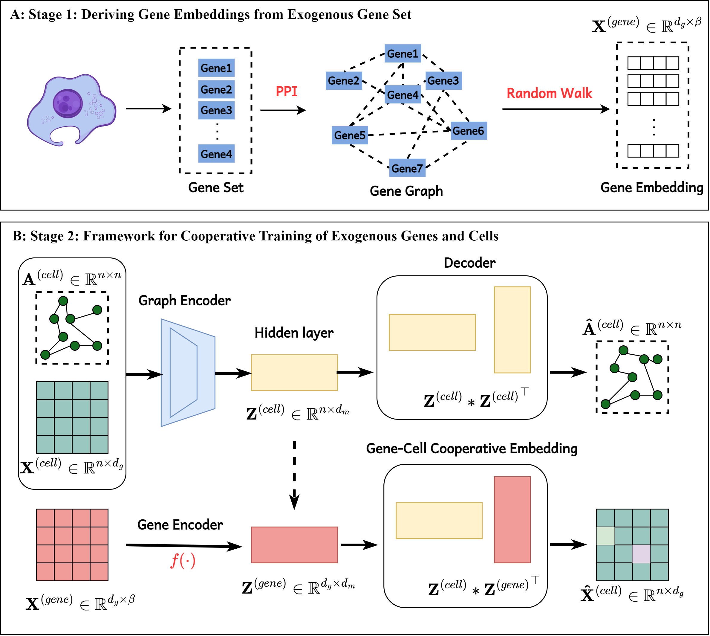

# scEGG: Exogenous Gene-guided Single-Cell Deep Clustering Framework

[](https://www.python.org/)
[](https://pytorch.org/)
[](https://academic.oup.com/bib)

## 📖 Overview

**scEGG** is a novel deep clustering framework designed specifically for single-cell transcriptomic analysis.

Traditional methods often rely solely on endogenous cellular features. **scEGG** advances this by simultaneously integrating **cell features** and **exogenous gene features**. By aligning and fusing these dual sources of information during the clustering process, the model generates a more discriminative representation, leading to superior clustering performance.

### Model Framework


> **Paper:** This work is published in *Briefings in Bioinformatics* (2024).


## 🛠 Requirements

Please ensure your environment meets the following dependencies:

* **Python** == 3.7.0
* **Torch** == 1.13.1
* **NumPy** == 1.21.6
* **Pandas** == 1.1.5
* **SciPy** == 1.7.3
* **Scikit-learn** == 0.22.2

### Installation
You can install the required packages using pip:

```bash
pip install torch==1.13.1 numpy==1.21.6 pandas==1.1.5 scipy==1.7.3 scikit-learn==0.22.2
````

-----

## 📂 Data Availability

We evaluated scEGG on several benchmark single-cell datasets. The original data sources can be accessed via the links below:

| Dataset | Source / Accession | Link |
| :--- | :--- | :--- |
| **Darmanis** | PubMed 26060301 | [PubMed](https://pubmed.ncbi.nlm.nih.gov/26060301/) |
| **Bjorklund**| GSE70580 | [NCBI GEO](https://www.ncbi.nlm.nih.gov/geo/query/acc.cgi?acc=GSE70580) |
| **Sun** | GSE128066 | [NCBI GEO](https://www.ncbi.nlm.nih.gov/geo/query/acc.cgi?acc=GSE128066) |
| **Marques** | PubMed 30078729 | [PubMed](https://pubmed.ncbi.nlm.nih.gov/30078729/) |
| **Zeisel** | PubMed 25700174 | [PubMed](https://pubmed.ncbi.nlm.nih.gov/25700174/) |
| **Fink** | PubMed 35914526 | [PubMed](https://pubmed.ncbi.nlm.nih.gov/35914526/) |

-----

## 🚀 Usage

### 1\. Configuration

The model parameters can be configured via command-line arguments. Key arguments (e.g., dataset name, number of clusters) are defined in the parser:

```python
# Example configuration
parser.add_argument('--dataset_str', default='Bjorklund', type=str, help='Name of the target dataset')
parser.add_argument('--n_clusters', default=4, type=int, help='Expected number of clusters')
# ... additional arguments ...
```

### 2\. Execution

To run the scEGG model with the default configuration:

```bash
python run_scEGG.py
```

-----

## 📧 Contact

If you have any questions about the code or the paper, please feel free to contact:

**Dayu Hu**
Email: [hudy@bmie.neu.edu.cn](mailto:hudy@bmie.neu.edu.cn)

-----


## 📝 Citation

If you find **scEGG** useful for your research, please consider citing our paper:

**Text:**

> Hu, D., Guan, R., Liang, K., Yu, H., Quan, H., Zhao, Y., Liu, X., & He, K. (2024). scEGG: an exogenous gene-guided clustering method for single-cell transcriptomic data. *Briefings in Bioinformatics*, 25(6), bbae483. Oxford University Press.

**BibTeX:**

```bibtex
@article{scEGG,
  title={scEGG: an exogenous gene-guided clustering method for single-cell transcriptomic data},
  author={Hu, Dayu and Guan, Renxiang and Liang, Ke and Yu, Hao and Quan, Hao and Zhao, Yawei and Liu, Xinwang and He, Kunlun},
  journal={Briefings in Bioinformatics},
  volume={25},
  number={6},
  pages={bbae483},
  year={2024},
  publisher={Oxford University Press}
}
```

```
```
